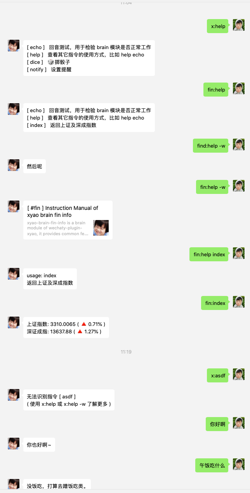

# wechaty-plugin-xyao

[](https://github.com/chatie/wechaty)
[](https://github.com/juzibot/Welcome/wiki/Everything-about-Wechaty)

wechaty-plugin-xyao 插件可以让你的 wechaty bot 具备以分布式模块执行自定义指令的能力。



bot 将 `fin:` 前缀的指令通过队列交给 fin 相关的模块处理，而 `x:`前缀的指令则通过队列交给 x 对应的处理模块。而对于哪些无法被识别
为指令的消息，会统一交给某个处理模块（通常是一个具备智能闲聊能力的处理模块，比如 百度 unit）。


这些处理模块被称之为 `brain 模块`，它相当于为 bot 赋予了某一个部分领域知识的副脑。


## Requirements

1. Node.js v12+
1. Wechaty v0.40+
1. This Plugin
1. Redis server
1. one or more brain service

## Usage

```ts
import { Wechaty } from 'wechaty';
import { PuppetPadplus } from 'wechaty-puppet-padplus';
import { Xyao } from '../src/mod';


const token = 'your PAD-PLUS token';
const puppet = new PuppetPadplus({ token });

const bot = new Wechaty({
  puppet,
  name : 'x.yao',
})

const xyaoConfig = {
  redis_host: 'localhost',
  redis_port: 6379,
  redis_password: '123456',
  redis_retry_interval: 5000,
  masters: ['wxid_of_master'],
  brains_cli: ['x', 'jira'],
  brains_ai: 'ai918',
  log_appender: 'dateFile',
  log_file: '/data/wechaty-xyao/xyao.log',
  log_level: 'INFO'
};


bot.use(
    Xyao(xyaoConfig),
)

bot.start()
    .catch(console.error)
```

### 1 配置插件

1. `redis_host`: redis ip
1. `redis_port`: redis 端口
1. `redis_password`: redis 密码
1. `redis_retry_interval`: redis 断线重连间隔
1. `masters`: 机器人的主人账号(注意是contact.id)，有部分指令必须是主人发起的才会执行
1. `brains_cli`: brain 列表
1. `brains_ai`: 未被识别为指令的的消息会交给这个 brain 模块
1. `log_appender`: `dateFile` 输出到指定文件，按日期分割； `stdout` 输出到控制台
1. `log_file`: 日志文件路径
1. `log_level`: 日志级别


## why wechaty-plugin-xyao

使用这个插件，至少会带来以下几个优势：
1. 如果机器人的业务处理和微信通讯部分都集中在单个进程，随着业务逻辑数量的增长，处理性能会遇到瓶颈，且一部分逻辑出现问题可能导致整个 bot crash，而解耦通讯与业务，并独立部署不同业务，能够有效缓解
这个问题。
2. 独立出的业务处理模块( `brain 模块` )可以采用任意适合该领域业务的语言（目前提供了一个基于 java springboot 的 brain 模块开发框架）。
3. 由于采用了基于 pub/sub 的消息中间件作为机器人和 brain 的通讯，因此即使两者之间由于 NAT 无法提供基于固定公网 IP 的 RPC 服务，也可以通过这种方式
打通交互。


## 部署架构参考


bot 在收到消息后，先尝试识别指令，识别为指令后，按前缀通过队列分发给指定的 brain 模块去处理。


每个 brain 模块都有自己唯一的标识，该标识会作为指令的前缀，比如 `fin:index` 指令会交给标识为 `fin` 的 brain 模块。


## 指令

指令是一条带有规定格式的微信消息。

比如跟机器人私聊或者在群内 @ 机器人，跟它说：

```
jira:bind-project -p READK223
```
那么这条消息将被机器人识别为指令，
 - `jira` 是 brain 模块标识，机器人根据此标识将指令传递给相应的 brain 处理模块
 - `bind-project` 是指令关键字，brain 模块根据此关键字决定采用哪段业务处理逻辑
 - `-p READK223` 是指令的选项，通常一个指令会有0到多个选项，采用不同的选项，会影响业务处理的逻辑
 
在开发 brain 的时候，建议支持 help 和 echo 指令，比如：
```
jira:help
jira:help bind-project
jira:echo tell me what i have said
```
- `jira:help` 返回标识为 jira 的 brain 模块所支持的所有的指令
- `jira:help bind-project` 返回 bind-project 指令的详情，包括支持的选项说明
- `jira:echo tell me what i have said` 返回 echo 的内容，用于检验该 brain 模块当前是否在线并正常工作


## brain 模块

通过 wechaty-plugin-xyao 插件创建的 wechaty 机器人，它只负责微信消息的收发，若要使它具备一定的业务处理能力，就需要为其扩展 brain 模块。
机器人收到消息并识别为指令后，将指令通过 redis 交给相应的 brain 模块，brain 根据指令种类及选项参数进行相应的业务处理，并将处理结果通过redis
再交给机器人，由机器人发送微信消息给指定的用户。

所以我们可以简单的理解为：wechaty 机器人是耳朵和嘴巴，而 brain 模块则是大脑。你可以部署多种用于处理不同领域问题的大脑，比如股票行情，企业内部
的项目管理，当然也包括常见的群组管理，定时通知，翻译等领域。

brain 模块的开发并不限定语言或平台，任何能够连上 redis 并且可以处理 json 的语言都可以开发 brain。

### 基于 java springboot 快速开发 brain 模块快

为了简化 brain 模块的开发，可参考基于 java springboot 的 brain 开发框架，它会尽量将业务无关部分的逻辑统一处理掉，并默认提供了 help 或 echo 指令。


## 已完成或计划中的 brain

|  brain  | status | description  |
|  ----  | ---- | ----  |
| [xyao-brain-trunk](https://github.com/watertao/xyao-brain-trunk) | 开发中 | 提供了微信机器人基本的处理能力，比如自定义 cron 形式的提醒，设置 todo-list, 消息搬运等特性 |
| [xyao-brain-jira](https://github.com/watertao/xyao-brain-jira) |  开发中 |提供 atlassion jira 相关的指令，比如将某个群组与某个 JIRA 项目绑定，定期推送每日 issue 进度及工时登录，检查 issue 规范性等 |
| [xyao-brain-fin-info](https://github.com/watertao/xyao-brain-fin-info) | 待开发 | 提供股市相关信息的查询或推送特性 |


