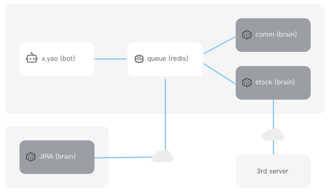

# wechaty-plugin-xyao

wechaty-plugin-xyao 插件可以帮助我们快速构建出一个基于 wechaty 的分布式指令分发机器人。



机器人在收到指令后，按规则通过 redis 分发给指定的 brain 模块去处理。


## brain 模块

通过 wechaty-plugin-xyao 插件创建的 wechaty 机器人，它只负责微信消息的收发，若要使它具备一定的业务处理能力，就需要为其扩展 brain 模块。
机器人收到消息并识别为指令后，将指令通过 redis 交给相应的 brain 模块，brain 根据指令种类及选项参数进行相应的业务处理，并将处理结果通过redis
再交给机器人，由机器人发送微信消息给指定的用户。

所以我们可以简单的理解为：wechaty 机器人是耳朵和嘴巴，而 brain 模块则是大脑。你可以部署多种用于处理不同领域问题的大脑，比如股票行情，企业内部
的项目管理，当然也包括常见的群组管理，定时通知等领域。

brain 模块的开发并不限定语言或平台，任何能够连上 redis 并且可以处理 json 的语言都可以开发 brain。除了插件本身外，为了简化 brain 模块的
开发，会有一个基于 java springboot 的开发框架用于开发 brain，它会尽量将业务无关部分的逻辑统一处理掉，并提供诸如 help 或 echo 等常见指令。
我们只需要专注于实现特定领域的指令处理逻辑即可。

## 已完成或计划中的 brain

|  brain  | status | description  |
|  ----  | ---- | ----  |
| [xyao-brain-trunk](https://github.com/watertao/xyao-brain-trunk) | 开发中 | 提供了微信机器人基本的处理能力，比如自定义 cron 形式的提醒，设置 todo-list, 消息搬运等特性 |
| [xyao-brain-jira](https://github.com/watertao/xyao-brain-jira) |  开发中 |提供 atlassion jira 相关的指令，比如将某个群组与某个 JIRA 项目绑定，定期推送每日 issue 进度及工时登录，检查 issue 规范性等 |
| [xyao-brain-fin-info](https://github.com/watertao/xyao-brain-fin-info) | 待开发 | 提供股市相关信息的查询或推送特性 |


## why wechaty-plugin-xyao

使用这个插件，至少会带来以下几个优势：
1. 如果机器人的业务处理和微信通讯部分都集中在单个进程，随着业务逻辑数量的增长，处理性能会遇到瓶颈，而解耦通讯与业务，并独立部署，能够有效缓解
这个问题。
2. 独立出的业务处理模块可以采用任意适合该业务领域的语言
3. 由于采用了基于 redis pub/sub 的消息中间件作为机器人和 brain 的通讯，因此即使两者之间由于 NAT 无法提供基于固定公网 IP 的 RPC 服务，也可以通过这种方式
打通交互。


## 指令

指令是一条带有规定格式的微信消息。

比如跟机器人私聊或者在群内 @ 机器人，跟它说：

```
jira:bind-project -p READK223
```
那么这条消息将被机器人识别为指令，
 - `jira` 是 brain 标识，机器人根据此标识将指令传递给相应的 brain 处理模块
 - `bind-project` 是指令关键字，brain 模块根据此关键字决定采用哪段业务处理逻辑
 - `-p READK223` 是指令的选项，通常一个指令会有0到多个选项，采用不同的选项，会影响业务处理的逻辑
 
在开发 brain 的时候，建议支持以下指令：
```
jira:help
jira:help bind-project
jira:echo tell me what i have said
```
- `jira:help` 返回标识为 jira 的 brain 模块所支持的所有的指令
- `jira:help bind-project` 返回 bind-project 指令的详情，包括支持的选项说明
- `jira:echo tell me what i have said` 返回 echo 的内容，用于检验该 brain 模块当前是否在线并正常工作


## Requirements

1. Node.js v12+
1. Wechaty v0.40+
1. This Plugin
1. Redis server
1. one or more brain service

## Usage

```ts
import { Wechaty, log } from 'wechaty';
import { Xyao } from '../src/mod';
import {
    EventLogger,
    QRCodeTerminal,
} from 'wechaty-plugin-contrib';

log.level("info");

const bot = new Wechaty({
    name : 'xyao',
})

const xyaoConfig = {
    redis_host: 'localhost',
    redis_port: 6379,
    redis_password: '123456',
    redis_retry_interval: 5000,
    masters: ['watertao'],
    brains_cli: ['m', 'jira']
};


bot.use(
    QRCodeTerminal({small: true}),
    Xyao(xyaoConfig),
)

bot.start()
    .catch(console.error)

```

### 1 配置插件

1. `redis_host`: redis ip
1. `redis_port`: redis 端口
1. `redis_password`: redis 密码
1. `redis_retry_interval`: redis 断线重连间隔
1. `masters`: 机器人的主人账号，有部分指令必须是主人发起的才会执行
1. `brains_cli`: brain 列表

